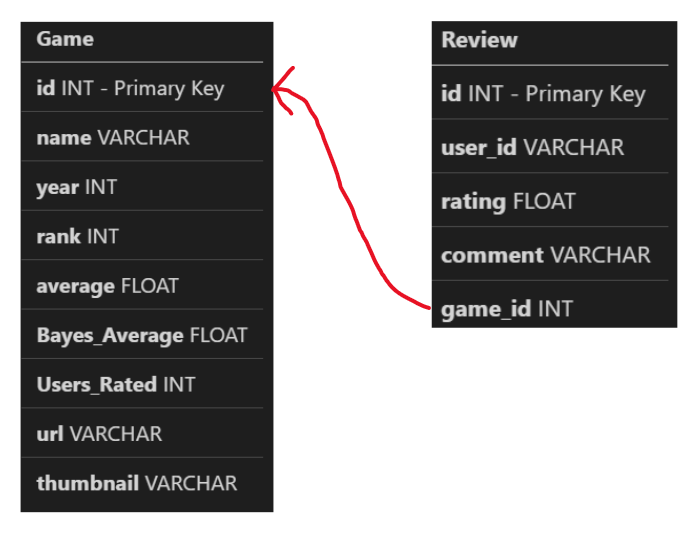

about.md is back to take its final, fullest form. Provide a complete about.md that includes the following (from previous versions)…

Link to the baseline dataset files
What the dataset contains
The application you have envisioned that uses this dataset: general description, prominent use cases (involving underlying data)
…with these new sections: 

- Rationale for why you chose the logical data model for this dataset and application—why was it the best fit? What features/characteristics were in its favor? What weren’t in its favor (but clearly wasn’t enough to overturn it)?
- Assessment—now that the assignment is done, how does your group feel about this choice?
Consider integrating your database schema (see below) into this document, if technically feasible. At a minimum, you should include a link to the file when appropriate.

# BoardGameGeek Reviews Dataset

## Link to Dataset
[Here](https://www.kaggle.com/jvanelteren/boardgamegeek-reviews?select=games_detailed_info.csv)

## What the dataset contains
  - This dataset contains information about many BoardGameGeek games including name, thumbnail, and so on. Also this dataset contains reviews for the games provided by users. The reviews have the rating, the player ID, the game ID and a couple more columns.
## Application for this dataset 
  - We are trying to provide functions for an application that helps a user pick a game to play. The application would give info on the ratings of the games, and helpful comments. This would allow users to search for games they know and evaluate the rating those games have. Also, the application would allow the users to add their own comments for games.
## Rationale for logical data model
  - We chose to use a relational data model. We have 2 disctinct groups which separate nicely into distict tables. For our envisioned application, there are a similar amount of insert/delete queries and read queries so the relational data model is best at averaging the performance of these queries. We have a much deeper understanding of relational databases thanks in part to expansive documentation.
  
  
  
  - [Link to schema](schema.sql)
## Assessment
  - The decision to use a relational database was a good decision. It would have been nice to visualize everything with a graph database, but it would have been much more challenging. The relational database is very funcitonal and allowed us to use a variety of queries to accomplish our goal. 

## NOTE
This was coded via VS Code's liveshare feature. This means that all members (Jeremy Goldberg, Andrey Varakin, David Sackler, Alvin Lai) contributed to the code, but commits were pushed from Jeremy Goldberg's GitHub account.