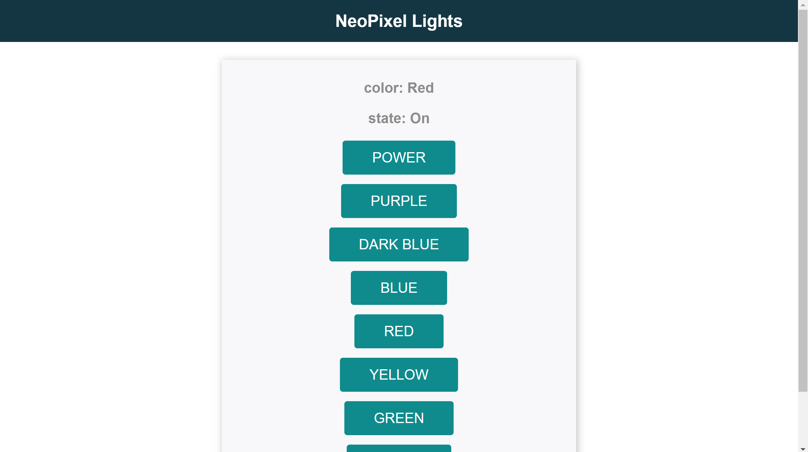

# NeoPixel Light Controller

This project is created to satisfy the final project of Networks 355. This project includes files to start an asynchronous WebSocket server on an ESP 8266 WiFi development board. Initially, the client can connect to this server through HTTP protocol, but then utilizes a WebSocket protocol to send and recieve information.

## Hardware Setup

Hardware used in this build:

- 300 LED NeoPixel Strip
- ESP 8266 Wi-Fi Development Board
- Circuitry

The first step is to power both your ESP 8266 board and the LED light strip. This can be done by following the instructions in [this link](https://www.instructables.com/ESP8266-controlling-Neopixel-LEDs-using-Arduino-ID/). In order for this software to run, the control wire for the LEDs should be connected to GPIO pin 4 on the 8266 board.

## Software setup

1. Install a service to send data to ESP 8266 boards. For example [Arduino IDE](https://www.arduino.cc/en/software) and [PlatformIO extension for VSCode](https://platformio.org/) can do this.
2. Follow any instructions to install these services and install any necessary drivers.
3. Install libraries
   - [Arduino NeoPixel](https://github.com/adafruit/Adafruit_NeoPixel)
   - [ESPAsyncWebServer](https://github.com/me-no-dev/ESPAsyncWebServer/archive/master.zip)
   - [ESPAsyncTCP](https://github.com/me-no-dev/ESPAsyncWebServer/archive/master.zip)
4. Copy the `src` folder into your project.
5. Change lines 38 (`ssid`) and 39 (`password`) to your specific network ID and password.
6. Build and upload the filesystem
   - This will put the `index.html` and `style.css` files onto your board
7. Compile and upload the `main.cpp` file to your board

## Usage

One the unit is powered and the software and harware is setup, the unit will immediately begin trying to connect to the network using the info provided. If connected to a serial monitor, once connected it will display the IP address. If you do not have a serial monitor, you can log in to your router and check the IP address assigned to the device. Then you can navigate to that address in any modern web browser. The page below should appear.

You can click the power button to turn off the lights. You can click a color to change the color of all the lights. You can connect to this server from multiple clients. Any change requested from one device will be propogated and displayed to all clients connected.

[Lights Demo](https://photos.app.goo.gl/QUsJihjBDRDECCMr8)
